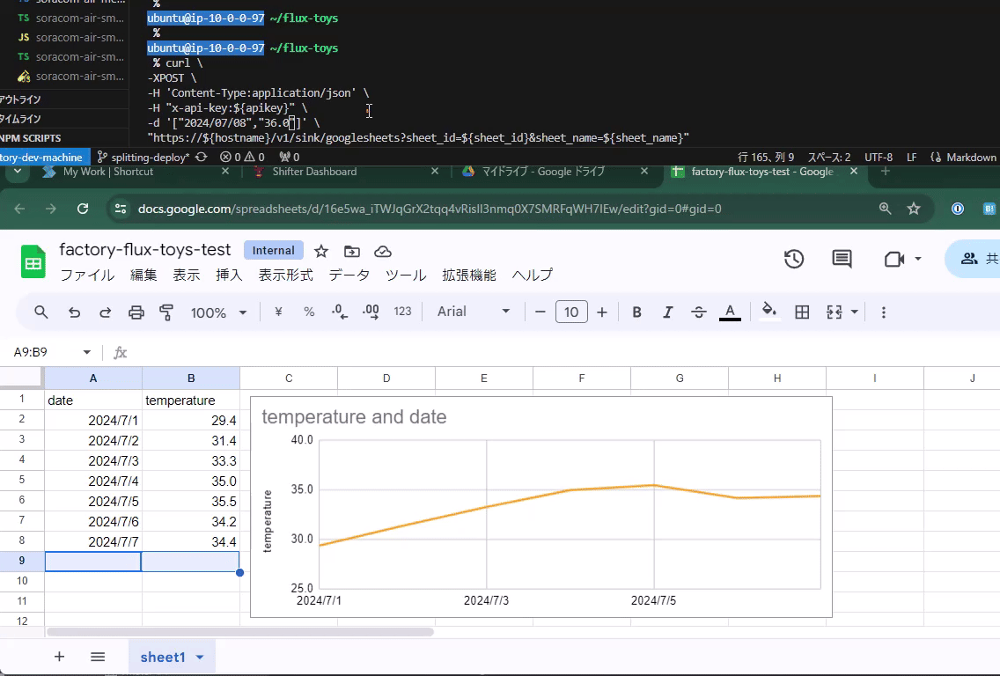

# FluxToys


This project provides a series of sources, sinks and integrations those we can play around with SORACOM Flux, a low code IoT aplication builder.

## Sources

### SoraCam(Soracom Cloud Camera Service)

A source webhook which uploads SorCam image to Soracom Harvest Files.

```
curl \
-XGET \
-H "x-api-key:${apikey}" \
"https://${hostname}/v1/source/soracam_image?device_id=${device_id}"
```

### SORACOM Harvest Data

A source webhook which returns a series of data entries from Soracom Harvest Data.

```
curl \
-XGET \
-H "x-api-key:${apikey}" \
"https://${hostname}/v1/source/soracom_harvest_data?resource_type=${reource_type}&resource_id=${resource_id}&coverage_type=${coverage_type}"
```

## Sinks

Sinks are outlet components to send data from Soracom Flux.

### SORACOM SIM metadata

This sink updates SORACOM SIM meta data with posted key and value.

Usage

```
curl \
-XPOST \
-H 'Content-Type:application/json' \ 
-H "x-api-key:${apikey}" \
-d '{"key":"${key}", "value":"${value}"} \
https://${hostname}/v1/sink/soracom_sim_metadata?sim_id=${sim_id}
```

### SORACOM SMS API

This sink sends a SMS with posted text.

Usage

```
curl \
-XPOST \
-H 'Content-Type:application/json' \
-H "x-api-key:${apikey}" \
-d '{"text":"${speech_text}"} \
https://${hostname}/v1/sink/soracom_sms_api?sim_id=${sim_id}
```

### Phone call

This sink makes a phone call with posted text.

Usage

```
curl \
-XPOST \
-H 'Content-Type:application/json' \
-H "x-api-key:${apikey}" \
-d '{"text":"${speech_text}"}
https://${hostname}/v1/sink/phonecall?target=${phone_number}
```

### AWS IoT Core

This sink publish a message to AWS IoT Core with posted topic.

```
curl \
-XPOST \
-H 'Content-Type:application/json' \
-H "x-api-key:${apikey}" \
-d '{"topic":"${topic}","${message}"} \
https://${hostname}/v1/sink/aws_iot_core
```

### Google Sheets

This sink emits a row to Google Spreadsheet. Each rows should be consists of ordered items like CSV.



Usage

```
curl \
-XPOST \
-H 'Content-Type:application/json' \
-H "x-api-key:${apikey}" \
-d '["${column1}", "${column2}", "${column3}", "${column4}"]' \
"https://${hostname}/v1/sink/googlesheets?sheet_id=${sheet_id}&sheet_name=${sheet_name}"
```

## Deploy

```
npm run installAll
npm run build
npm cdk deploy \
  --context soracomAuthKeyId=${SORACOM_AUTH_KEY_ID} \ 
  --context soracomAuthKey=${SORACOM_AUTH_KEY} \
  --context harvestFilesPath=${HARVEST_FILES_DIR_PATH}
```


